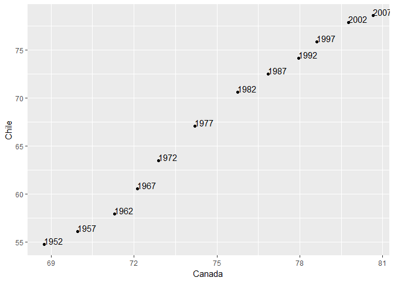

Homework\_04
================
Coni
October 4, 2018

-   [Homework 04: Tidy data and joins](#homework-04-tidy-data-and-joins)
    -   [Data Reshaping Prompts (and relationship to aggregation)](#data-reshaping-prompts-and-relationship-to-aggregation)
    -   [Join Prompts (join, merge, look up)](#join-prompts-join-merge-look-up)

Homework 04: Tidy data and joins
================================

In this assignment we use `tidyr` and `dplyr`

``` r
library(tidyr)
library(dplyr)
library(gapminder)
library(tidyverse)
```

Data Reshaping Prompts (and relationship to aggregation)
--------------------------------------------------------

*Problem:* You have data in one “shape” but you wish it were in another. Usually this is because the alternative shape is superior for presenting a table, making a figure, or doing aggregation and statistical analysis.

*Solution:* Reshape your data. For simple reshaping, `gather()` and `spread()` from `tidyr` will suffice. Do the thing that is possible / easier now that your data has a new shape.

Before getting into the assignment activity, let's remember what `gather()` and `spread()` do

1.  `gather()`

It's used for making untidy data tidy. It takes multiple columns, and gathers them into key-value pairs: it makes “wide” data longer.

*Format:* `gather`(`data`, `key = "key_name"`, `value = "value"`, `...`) where:

-   `"key_name"` is what we want to call the column headers that became a variable,

-   `"value"` is what we want to call the stacked columns that became a variable

-   and the last argument `...` correspond to the items we want to include or not include in the new table

Let's first have a look at the iris data frame

``` r
head(iris)
```

    ##   Sepal.Length Sepal.Width Petal.Length Petal.Width Species
    ## 1          5.1         3.5          1.4         0.2  setosa
    ## 2          4.9         3.0          1.4         0.2  setosa
    ## 3          4.7         3.2          1.3         0.2  setosa
    ## 4          4.6         3.1          1.5         0.2  setosa
    ## 5          5.0         3.6          1.4         0.2  setosa
    ## 6          5.4         3.9          1.7         0.4  setosa

And then take a subset of this df by slicing the first appearance of each species

``` r
mini_iris <- 
  iris %>%
  group_by(Species) %>% #group by species
  slice(1) #takes only the first row of each group

knitr::kable(mini_iris) #print table
```

|  Sepal.Length|  Sepal.Width|  Petal.Length|  Petal.Width| Species    |
|-------------:|------------:|-------------:|------------:|:-----------|
|           5.1|          3.5|           1.4|          0.2| setosa     |
|           7.0|          3.2|           4.7|          1.4| versicolor |
|           6.3|          3.3|           6.0|          2.5| virginica  |

Now we can make this untidy data tidy with gather()

``` r
tidy_mini_iris <- mini_iris %>% 
  gather(key = flower_att, #creates a new column named flower_att that contains the measurement type
         value = measurement, #contains the value of the measurement type for each species
         -Species) #include the species name in the new table

knitr::kable(tidy_mini_iris)
```

| Species    | flower\_att  |  measurement|
|:-----------|:-------------|------------:|
| setosa     | Sepal.Length |          5.1|
| versicolor | Sepal.Length |          7.0|
| virginica  | Sepal.Length |          6.3|
| setosa     | Sepal.Width  |          3.5|
| versicolor | Sepal.Width  |          3.2|
| virginica  | Sepal.Width  |          3.3|
| setosa     | Petal.Length |          1.4|
| versicolor | Petal.Length |          4.7|
| virginica  | Petal.Length |          6.0|
| setosa     | Petal.Width  |          0.2|
| versicolor | Petal.Width  |          1.4|
| virginica  | Petal.Width  |          2.5|

1.  `spread()`

Takes two columns (key & value) and spreads in to multiple columns. Useful to make “long” data wider.

``` r
untidy_mini_iris <- spread(tidy_mini_iris,flower_att, measurement)

knitr::kable(untidy_mini_iris)
```

| Species    |  Petal.Length|  Petal.Width|  Sepal.Length|  Sepal.Width|
|:-----------|-------------:|------------:|-------------:|------------:|
| setosa     |           1.4|          0.2|           5.1|          3.5|
| versicolor |           4.7|          1.4|           7.0|          3.2|
| virginica  |           6.0|          2.5|           6.3|          3.3|

*Prompt:* Activity \#2

Make a tibble with one row per year and columns for life expectancy for two or more countries.

-   Use knitr::kable() to make this table look pretty in your rendered homework.
-   Take advantage of this new data shape to scatterplot life expectancy for one country against that of another.

``` r
head(gapminder)
```

    ## # A tibble: 6 x 6
    ##   country     continent  year lifeExp      pop gdpPercap
    ##   <fct>       <fct>     <int>   <dbl>    <int>     <dbl>
    ## 1 Afghanistan Asia       1952    28.8  8425333      779.
    ## 2 Afghanistan Asia       1957    30.3  9240934      821.
    ## 3 Afghanistan Asia       1962    32.0 10267083      853.
    ## 4 Afghanistan Asia       1967    34.0 11537966      836.
    ## 5 Afghanistan Asia       1972    36.1 13079460      740.
    ## 6 Afghanistan Asia       1977    38.4 14880372      786.

``` r
(mini_gapminder <- gapminder %>%
  select(country, year, lifeExp) %>% #keep only variables we want
  filter(country == "Chile" | country == "Canada" )) # keep only countries we want
```

    ## # A tibble: 24 x 3
    ##    country  year lifeExp
    ##    <fct>   <int>   <dbl>
    ##  1 Canada   1952    68.8
    ##  2 Canada   1957    70.0
    ##  3 Canada   1962    71.3
    ##  4 Canada   1967    72.1
    ##  5 Canada   1972    72.9
    ##  6 Canada   1977    74.2
    ##  7 Canada   1982    75.8
    ##  8 Canada   1987    76.9
    ##  9 Canada   1992    78.0
    ## 10 Canada   1997    78.6
    ## # ... with 14 more rows

``` r
mini_gapminder %>% 
  spread(country, lifeExp) %>% #make tibble where countries are columns and years are rows
  ggplot(aes(Canada, Chile, label = year)) + #scatterplot lifeExp of Canada vs Chile
  geom_point() +
  geom_text(aes(label = year), hjust = 0, vjust = 0) #add labels and adjust position
```



Join Prompts (join, merge, look up)
-----------------------------------

*Problem:* You have two data sources and you need info from both in one new data object.

*Solution:* Perform a join, which borrows terminology from the database world, specifically SQL.

*Prompt:* Activity \#1

Create a second data frame, complementary to Gapminder. Join this with (part of) Gapminder using a dplyr join function and make some observations about the process and result. Explore the different types of joins.

Examples of a second data frame you could build: - One row per country, a country variable and one or more variables with extra info, such as language spoken, NATO membership, national animal, or capitol city. - One row per continent, a continent variable and one or more variables with extra info, such as northern versus southern hemisphere.

Stuck trying to get data to use as a second data frame...

``` r
library(readxl)
```

    ## Warning: package 'readxl' was built under R version 3.4.4

``` r
#asd <- read_excel("https://github.com/Gapminder-Indicators/tfr/raw/master/tfr-by-gapminder.xlsx")
```
